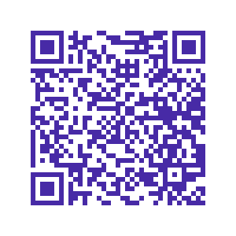

# Introduction 
The idea originated from my earlier job, where every time sales page or or pitch changed, we had to reprint the company merchandise with the updated QR code.

The App was created so you could customise where you QrCode points to.

# Demo

To see the working demo go to https://app-virgin-client-test.azurewebsites.net

> Demo User:  
> username: test-customer  
> password: Fuho3479

After you configure the active redirect url you can see your content on https://virgin-api-test.azurewebsites.net/api/QR/7728cbbf-e4e5-47de-bbbb-ab5888fc6889

or scan the QrCode:   

### Notes:
The backend is hosted on Azure App Services - free tier, so the app is in cold start mode, it may take somewhere from 10 to 30 seconds for it to start up initially.

> App is intended for mobile use

> **Demo user is reset to a state of a brand new account a minute after app startup.**

> The app is downloadable as a PWA

# Technical overview
- Backend: __.Net 5__
- Frontend: __Angular 11__
- Identity service: __Azure Ad B2C__
- For managing and creating users: __MicrosoftGraphApi__
- For log notifications: __Serilog email sink using Sendgrid__
